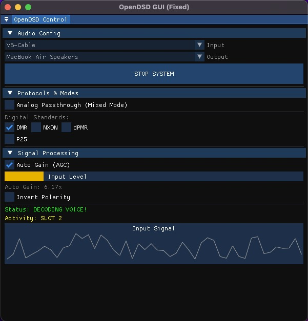

# OpenDSD GUI

OpenDSD GUI is a simple, cross-platform graphical interface for monitoring Digital Mobile Radio (DMR) and other digital voice protocols. It acts as a lightweight, user-friendly wrapper around the `DSDcc` decoding library.



## Build Instructions

### Prerequisites
* CMake (3.15+)
* C++ Compiler (Clang/GCC)
* **macOS:** Xcode Command Line Tools
* **Linux:** `sudo apt install build-essential cmake libasound2-dev libgl1-mesa-dev xorg-dev`

### Compilation

```bash
mkdir build
cd build
cmake ..
make
./OpenDSD_GUI
```

### Credits
 - **DSDcc**: Copyright (C) 2016 Edouard Griffiths, F4EXB.

 - **mbelib**: Copyright (C) 2010 szechyjs.

 - **miniaudio**: David Reid.

 - **Dear ImGui**: Omar Cornut.

### License
This project is licensed under the GNU GPL v3 License.
